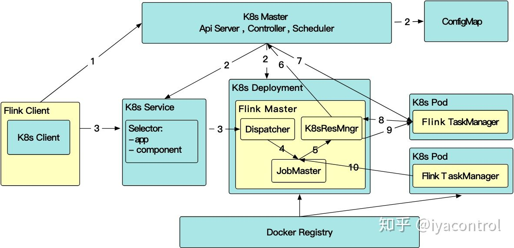
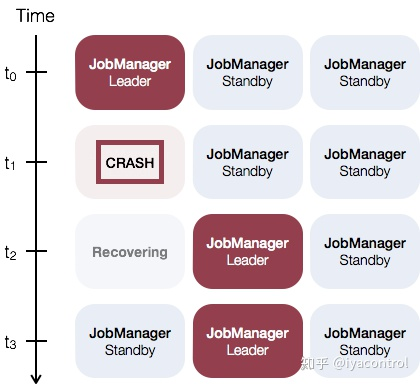

* [Flink1\.12 native kubernetes 演进](#flink112-native-kubernetes-演进)
  * [Flink 1\.10](#flink-110)
  * [Flink 1\.11](#flink-111)
  * [Flink 1\.12](#flink-112)
  * [总结](#总结)

# Flink1.12 native kubernetes 演进



## Flink 1.10

Flink 1.10 开始支持将 native kubernetes 作为其资源管理器。在该版本中，你可以使用以下命令在你的 kubernetes 集群中创建一个flink session。

```shell
./bin/kubernetes-session.sh \
  -Dkubernetes.cluster-id=<ClusterId> \
  -Dtaskmanager.memory.process.size=4096m \
  -Dkubernetes.taskmanager.cpu=2 \
  -Dtaskmanager.numberOfTaskSlots=4 \
  -Dresourcemanager.taskmanager-timeout=3600000
```

此时创建session 的 kubernetes 相关参数支持的比较少，只支持设置资源大小，容器镜像，命名空间等[基本参数](https://link.zhihu.com/?target=https%3A//ci.apache.org/projects/flink/flink-docs-release-1.10/ops/config.html%23kubernetes)。对于生产环境，暴露这些参数远远不够。

然后使用如下的命令，提交任务到我们刚刚创建的Session 中：

```shell
 ./bin/flink run -d -e kubernetes-session -Dkubernetes.cluster-id=<ClusterId> examples/streaming/WindowJoin.jar
```

## Flink 1.11

Flink1.11， 首先创建 session 的kubernetes 相关参数支持增多了，支持了node-selector， tolerations等调度[相关参数](https://link.zhihu.com/?target=https%3A//ci.apache.org/projects/flink/flink-docs-release-1.11/ops/config.html%23kubernetes)，并且支持设置保留JobManager端点的服务类型。

支持资源调度相关参数，对于生产环境非常重要。我们可以控制我们的 session 集群资源，主要是jobmanager 和 taskmanager 调度到指定的机器上，是实现资源隔离，安全，计费的前提。

另外flink1.11 新增了Application 模式（和Session 模式不同）。Application模式允许用户创建一个包含作业和Flink运行时的镜像，根据需要自动创建和销毁集群组件。

该模式就更加云原生了，可以充分发挥native k8s的弹性。根据提交的任务，来自动创建jobmanager 和 taskmanager ，待任务运行完成，则自动销毁jobmanager 和 taskmanager 。

可以使用如下命令，启动application：

```shell
 ./bin/flink run-application -p 8 -t kubernetes-application \
  -Dkubernetes.cluster-id=<ClusterId> \
  -Dtaskmanager.memory.process.size=4096m \
  -Dkubernetes.taskmanager.cpu=2 \
  -Dtaskmanager.numberOfTaskSlots=4 \
  -Dkubernetes.container.image=<CustomImageName> \
  local:///opt/flink/usrlib/my-flink-job.jar
```

## Flink 1.12



Flink 1.12 之前的版本中JobManager的 HA 是通过ZooKeeper 来实现的。

在1.12 版本中，Kubernetes提供了Flink可用于JobManager故障转移的内置功能，而不是依赖ZooKeeper。Kubernetes HA 服务与ZooKeeper实现基于相同的基本接口构建，并使用Kubernetes的ConfigMap对象处理从JobManager故障中恢复所需的所有元数据。

为了启动HA集群，您必须配置以下步骤：

- [high-availability](https://link.zhihu.com/?target=https%3A//ci.apache.org/projects/flink/flink-docs-release-1.12/deployment/config.html%23high-availability-1)(required): `high-availability` 选项必须设置为KubernetesHaServicesFactory。

```text
high-availability: org.apache.flink.kubernetes.highavailability.KubernetesHaServicesFactory
```

- [high-availability.storageDir](https://link.zhihu.com/?target=https%3A//ci.apache.org/projects/flink/flink-docs-release-1.12/deployment/config.html%23high-availability-storagedir)(required): JobManager元数据将持久保存在文件系统`high-availability.storageDir`中，并且仅指向此状态的指针存储在Kubernetes中。

```text
high-availability.storageDir: s3:///flink/recovery
```

- [kubernetes.cluster-id](https://link.zhihu.com/?target=https%3A//ci.apache.org/projects/flink/flink-docs-release-1.12/deployment/config.html%23kubernetes-cluster-id)(required): 为了标识Flink集群，您必须指定kubernetes.cluster-id。

```text
kubernetes.cluster-id: cluster1337
```

此外flink 1.12 支持flink 中程序使用kubernetes 中的secrets。通过如下两种方式：

- 将Secrets用作Pod中的文件；
- 使用Secrets作为环境变量；

这样的话，我们可以将一些敏感凭证数据放到Secret中。在安全性上是一种增强。

最后Flink使用`Kubernetes OwnerReference`来清理所有集群组件。由Flink创建的所有资源，包括ConfigMap，Service和Pod，都将OwnerReference设置为`Deployment/<cluster-id>`。删除部署后，所有相关资源将自动删除。

## 总结

Flink 对于native kubernetes 的支持逐步增强，kubernets 相对于yarn等资源管理器，有着诸多的优势。